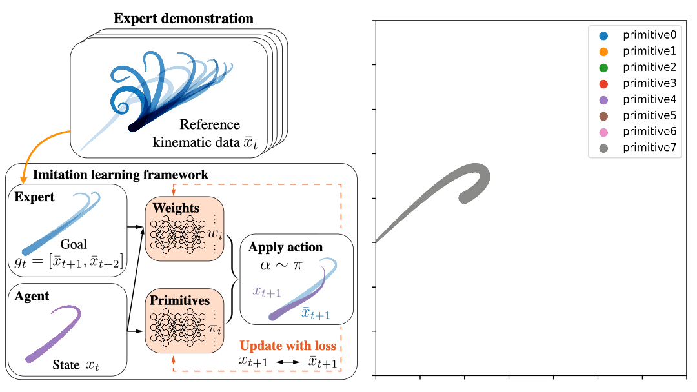
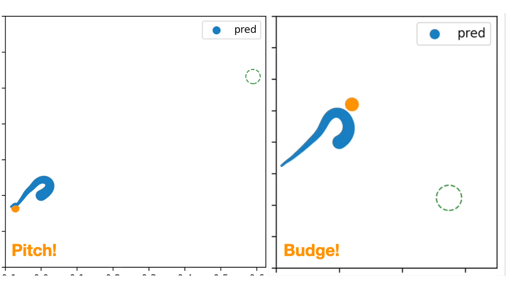

# Control-of-an-soft-arm-with-dynamic-primitives

The goal of this project is to manipulate a soft arm to generate complicated motions with dynamic primitives. The good thing about dynamic primitives is that they are not task-dependent but simply representations of movements. Once we obtain these primitives, we can compose them in new ways to form complex behaviors for many different tasks. To do so, we employ Multiplicative Compositional Policy (MCP)[1].

We obtain [dynamic primitives](https://github.com/chshih2/Control-of-an-soft-arm-with-dynamic-primitives/tree/main/primitives) from a typical octopus bend-propagation movement using imitating learning.

The obtained dynamic primitives are used to achieve [budge and pitch tasks](https://github.com/chshih2/Control-of-an-soft-arm-with-dynamic-primitives/tree/main/control-tasks), requiring consideration of dynamics and an additional sucker control.

