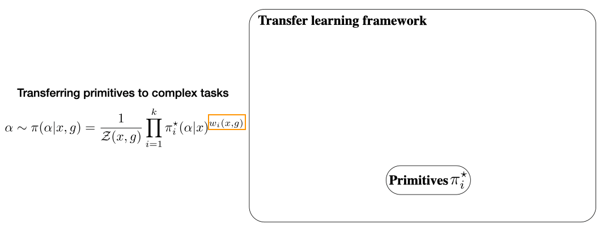
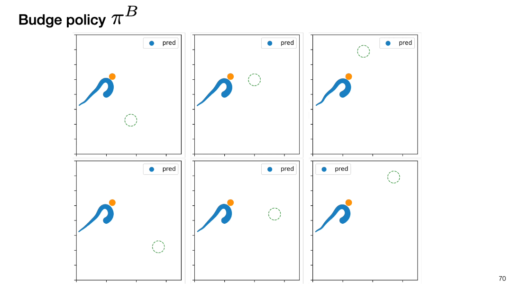
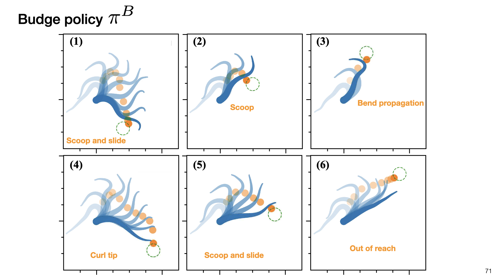
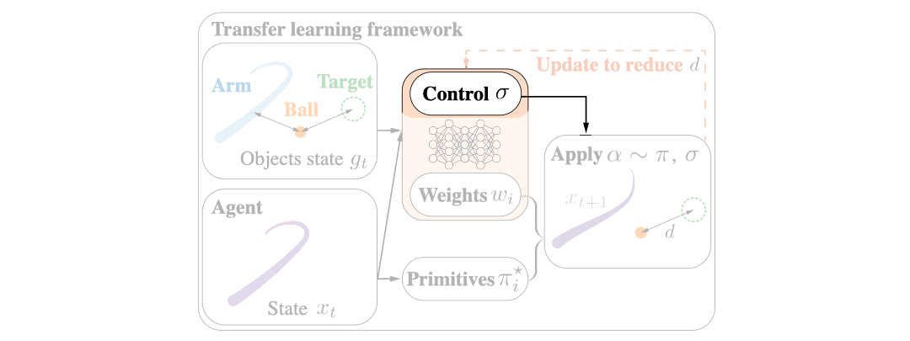
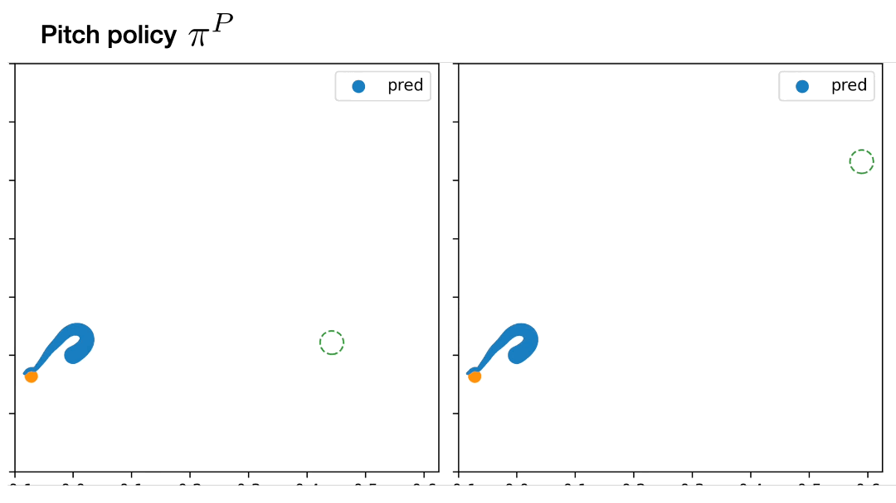
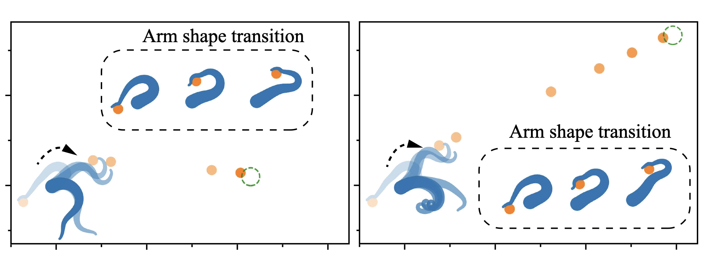

# Dynamic whole-arm manipulation
With the [dynamic primitives learned from bend-propagation motions](https://github.com/chshih2/Control-of-an-soft-arm-with-dynamic-primitives/tree/main/primitives), I transfer these primitives to solve tasks requiring manipulating an object in transient dynamic scenarios.

## Manipulation with dynamic primitives
This is achieved by training new weight functions in MCP[1] to compose the primitives in new ways to form a bigger range of behaviors. In the framework, I replace the previous neural network with the obtained primitives $\pi_i^\star$, while the weight functions are still approximated by a neural network. For manipulation tasks, I set the goal in terms of the relationship between the arm, the ball, and the target. The composite policy of $\pi_i^\star$ and $w_i$ is then used to sample actions. I set the reward in terms of the distance of the ball and the target and update the weight network using policy gradient method.

I first consider a problem where the goal is for the arm to budge a ball into a target area. The target area is randomly generated from a target box. Here, the arm has no sucker, and thus the ball can slide along the arm. This feature increases the importance for whole-arm control  and long-term planning because the agent needs to carefully consider interactions during the entire process. This is unlike the typical robotic setup where the object is assumed to be fixed to the arm while moving

Here are the examples of the trained policy successfully controls the arm to budge the ball into various target areas. 

Looking at the transition, we can see that the arm often starts with a scooping motion, and later on switch to a elbow shape in the other direction to redirect the ball towards the target area
We also see that in this case, the ball is sliding out of the arm, so the arm curls its tip just a bit to effectively change the ball’s final direction
And When the target is out of reach, the arm slides the ball to its tip and pushes with sufficient velocity by straightening the whole arm. 

## Sucker control
The primitives work well for the whole-arm manipulation task, but can it work well with additional controls? For example, what if the soft arm has suckers? To test it out, I simply add the control variable sigma in the framework and let it learn along with the weights $w_i$. 

Here, I use this framework to solve a pitching problem where the target area is now randomly generated from a box far outside of the arm’s workspace. The arm has a sucker at the tip and the sucker actuation is a binary control variable. The task requires the arm to decide how to deform and orient the arm and when to release the ball.

Here are the examples of the pitch policy — the arm keeps the ball attached while aiming the ball at the right direction and launches when the ball has sufficient initial velocity to finally reach the target area.

Looking at the transition, the policy shows a consistent strategy regardless of target locations. Here are one case with the target area is close to the arm and one with the target above and far from the arm. For both cases, the arm transitions similarly with only slight change of shooting angle.

[1] Peng, X. B., Chang, M., Zhang, G., Abbeel, P., & Levine, S. (2019). Mcp: Learning composable hierarchical control with multiplicative compositional policies. Advances in Neural Information Processing Systems, 32.
