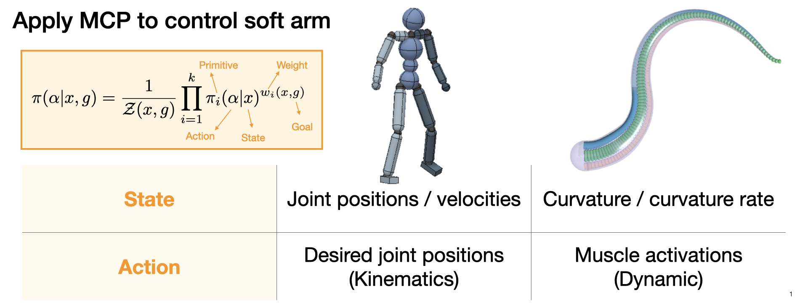
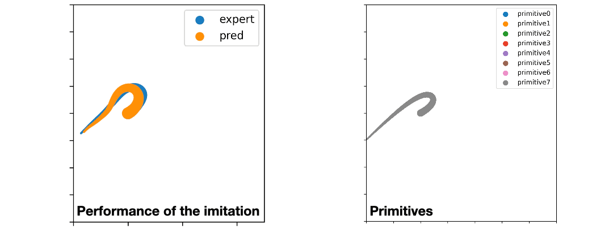
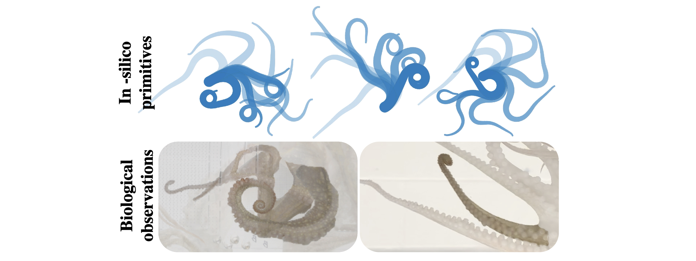

# Dynamic primitives of an octopus arm

Dynamic primitives are not task-dependent but simply representations of movements. Once we obtain these primitives, we can compose them in new ways to form complex behaviors for many different tasks. To obtain dynamic primitives of an octopus arm, we employ Multiplicative Compositional Policy (MCP)[1].

## Multiplicative Compositional Policy (MCP)
To illustrate the method, here is an example of a humanoid in the original paper[1]. The idea here is that walking and turning are well-studied motions and are essential for any tasks involving locomotion. So without the prior knowledge of the primitives, the approach taken here is simply learn the primitives by learning to imitate the walking and turning with a special formulation of the policy. With the primitives they got from walking and turning, they can compose them to achieve a big range of behaviors for other tasks, such as following random target directions and dribble a ball to a goal.

The policy is formulated to modulate multiple primitives. The primitive $pi_i$ is a policy that provides action given state. This primitive formulation does not depend on specific tasks, so that it can be used to represent dynamic motions regardless of the underlying goal. To consider the task, we define $w_i$ as a function of the arm states and the task goal with the weight for primitive $pi_i$ as the output. Together, all $k$ weights and primitives composite an action distribution defined as the weighted product of the primitives. (The policy can be written this way because each primitives is modeled as a Gaussian distribution over the action space)

My contribution here is to apply MCP to the soft arm. While the state for the humanoid is joint position and velocity, I use curvature and curvature rate for the soft arm. For the action, the humanoid takes position control, so it’s in terms of the desired joint positions. I’m using muscle activations for the soft arm control which is dynamic. Here is the detail of the [muscle-activated soft-arm model](https://github.com/chshih2/Real-time-control-of-an-octopus-arm-NNES).

## Extract motion primitives from bend-propagation
I first learn primitives by imitating a typical motion. Here I choose bend-propagation because this motion is most-studied, and believed to be a key strategy for the octopus to perform reaching movement. To collect expert demonstration, I applying a muscle activation control derived in [2]. The activation is designed and validated for bend propagation on a tapered soft arm. I apply the control from base to tip and then from tip to base, and generate 8 motion clips, including 4 shooting angles and 2 curl-back directions. From these clips, only the curvature and curvature rate are used as the reference data $\bar{x}$. 

Here is an example of  the recovered motion with 8 primitives , and we can see that the composite policy can imitate the expert well. The primitives for this policy show that they learn to specialize in different motions, including different curling directions, bending angles at the base, and (un)folding movements.

Note that even though these configurations are not typically obtained in soft robotic control, they all consist of distinct elbow formations and tip curlings observed in real octopus arms.

[1] Peng, X. B., Chang, M., Zhang, G., Abbeel, P., & Levine, S. (2019). Mcp: Learning composable hierarchical control with multiplicative compositional policies. Advances in Neural Information Processing Systems, 32.
